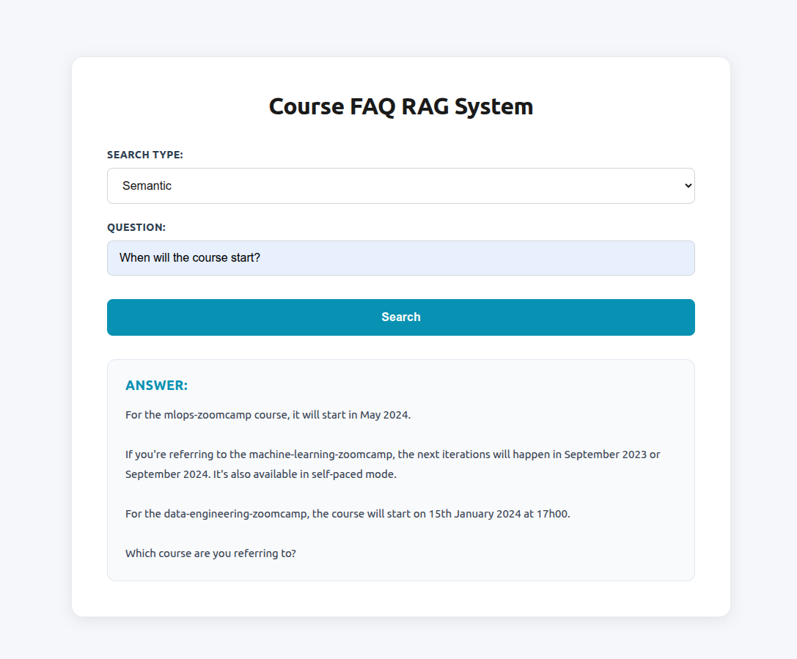
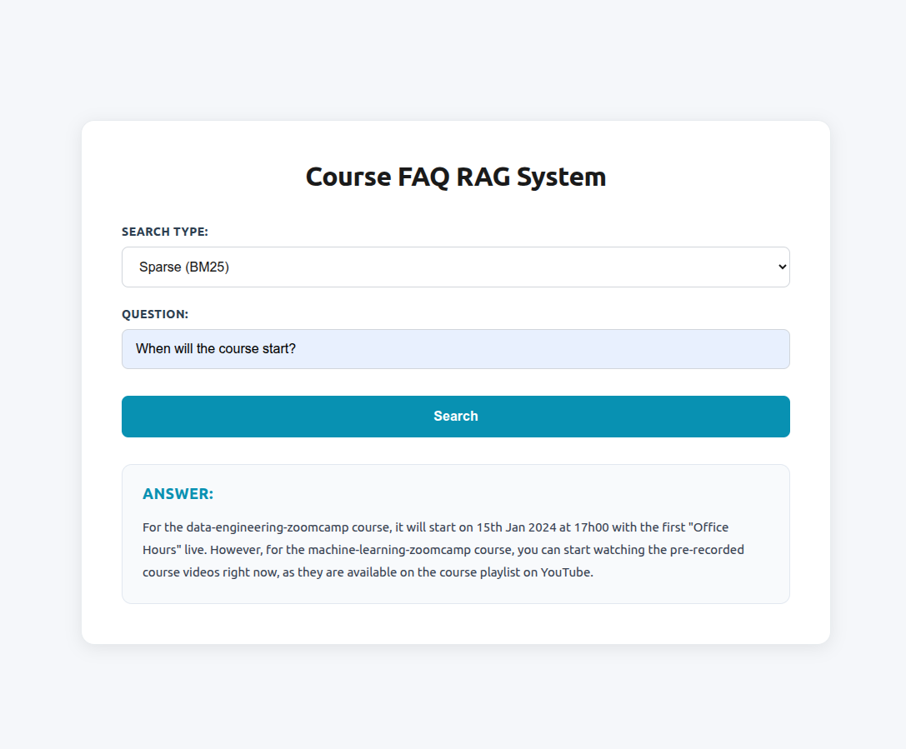
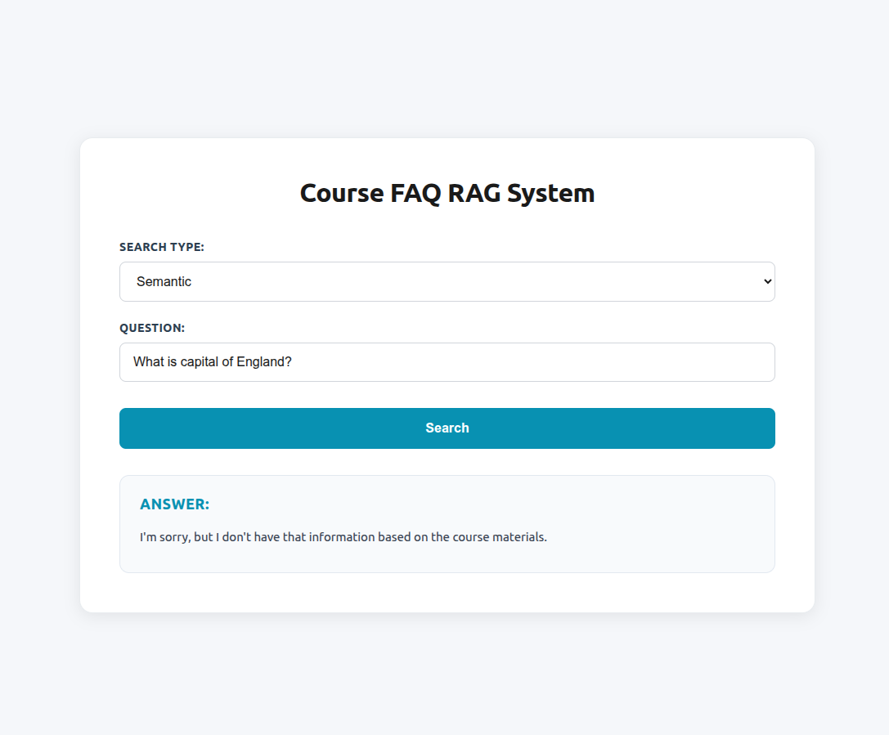

# Course FAQ RAG Application

A Retrieval-Augmented Generation (RAG) application built as an implementation of the DataTalksClub LLM Zoomcamp Module 2. This project demonstrates semantic search, sparse search, and hybrid search capabilities using a custom tech stack.

## Overview

This application provides an interactive web interface for querying course FAQ documents using three different search strategies. Users can ask questions and receive AI-generated answers based on retrieved context from the course documentation.

## Tech Stack

- **Backend**: FastAPI
- **Vector Database**: Qdrant (with local FastEmbed for embeddings)
- **LLM**: Groq API (Llama 3.3 70B Versatile)
- **Embeddings**: BAAI/bge-small-en (384 dimensions)
- **Frontend**: Plain HTML, CSS, and JavaScript

## Features

- **Three Search Modes**: Semantic, Sparse (BM25), and Hybrid search
- **RAG Pipeline**: Retrieval-Augmented Generation for context-aware answers
- **Interactive Web UI**: Simple and intuitive interface for querying
- **Real-time Search**: Fast retrieval and answer generation

## Setup

### Prerequisites

- Python 3.10+
- Docker (for running Qdrant)
- Groq API key

### Installation

1. **Create a virtual environment**:
   ```bash
   python -m venv venv
   source venv/bin/activate  # On Windows: venv\Scripts\activate
   ```

2. **Install dependencies**:
   ```bash
   pip install -r requirements.txt
   ```

   Required packages:
   - `fastapi==0.104.1`
   - `uvicorn==0.24.0`
   - `pydantic==2.5.0`
   - `qdrant-client==1.7.0`
   - `groq==1.0.0`
   - `python-dotenv==1.0.0`

3. **Set up environment variables**:
   
   Create a `.env` file in the project root:
   ```
   GROQ_API_KEY=your_groq_api_key_here
   ```

   You can obtain a Groq API key from [console.groq.com](https://console.groq.com).

4. **Ensure Qdrant collections are set up**:
   
   The application expects three Qdrant collections to be pre-populated:
   - `course_faq` (semantic search)
   - `course_faq_sparse` (sparse search)
   - `course_faq_hybrid` (hybrid search)
   
   These should be created and populated using the provided Jupyter notebooks.

## How to Run

### 1. Start Qdrant (Docker)

Start Qdrant using Docker:
```bash
docker run -p 6333:6333 -p 6334:6334 qdrant/qdrant
```

Qdrant will be available at `http://localhost:6333`.

### 2. Start the FastAPI Server

Run the FastAPI application:
```bash
uvicorn app:app --reload
```

The server will start on `http://127.0.0.1:8000`.

### 3. Access the Application

Open your browser and navigate to:
```
http://localhost:8000
```

## Search Types

The application provides three distinct search modes, each optimized for different use cases:

### Semantic Search

Uses dense vector embeddings (`BAAI/bge-small-en`) to find semantically similar documents. This approach captures meaning and context, making it effective for queries that may not use exact keyword matches.

- **Collection**: `course_faq`
- **Embedding Model**: BAAI/bge-small-en (384 dimensions)
- **Distance Metric**: Cosine similarity
- **Best For**: Conceptual queries, synonyms, and meaning-based searches

### Sparse Search (BM25)

Uses BM25 (Best Matching 25) algorithm via Qdrant's integrated sparse vector model. This traditional information retrieval method excels at keyword matching and term frequency analysis.

- **Collection**: `course_faq_sparse`
- **Model**: Qdrant/bm25
- **Best For**: Exact keyword matches, specific terms, and traditional text search

### Hybrid Search

Combines both dense (semantic) and sparse (BM25) search results using Reciprocal Rank Fusion (RRF). This approach leverages the strengths of both methods to provide more comprehensive and accurate results.

- **Collection**: `course_faq_hybrid`
- **Fusion Method**: Reciprocal Rank Fusion (RRF)
- **Dense Vector**: bge_small embeddings
- **Sparse Vector**: BM25
- **Best For**: General-purpose queries requiring both semantic understanding and keyword precision


## UI Screenshots

| Semantic Search Results | Sparse Search Results |
|------------------------|----------------------|
|  |  |
| **Hybrid Search Results** | **Unrelated Question Response** |
|  |  |


## Notes

- The application assumes Qdrant collections are pre-populated with course FAQ data
- Embeddings are generated locally using FastEmbed
- The RAG prompt template matches the implementation from the LLM Zoomcamp course